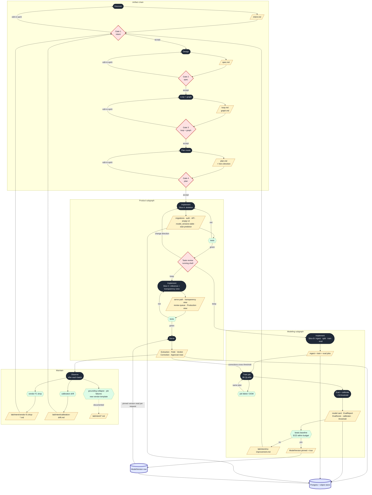

# Graph: Ledgerlens SDLC as a directed graph

*Generated from the accepted `spec.md`. Four node kinds only: **Play** (agent session), **Artifact** (committed file or DB row), **Gate** (human accept/reject), **Signal** (machine event). Edges are triggers.*

## Rules this graph obeys

- No node exists to satisfy ceremony. No `tasks.md`.
- Exactly four gates plus one optional taste review. More is micromanagement.
- Every implement path is restartable: a crashed train re-enters the Train play with the same plan; it never demands a new spec.
- The **modeling subgraph** and the **product subgraph** share two things: the database and the `ModelVersion` row. That join is the point of the lab.

## The graph

## Reading the graph

- **The chain at the top** is the only part that looks like "SDD". Four artifacts, four gates, each gate loops back to its own play on edit-in-spirit — never further back.
- **Slice A ships a database and a web app before a weight file exists.** The taste review on the running shell is the one optional human node inside build.
- **Slices B and C run in parallel** after the taste review; they meet at the `ModelVersion` row. B writes it; C reads it per request. Neither knows the other's internals.
- **The Train play is a cycle with its own failure signal.** OOM or crash goes back into Train with the same plan. Nothing upstream is touched.
- **Pinning is an artifact, not a play.** It is a row flip, audited, and it is the single edge that lets a trained model reach a user.
- **Maintain has no human in it.** Observe runs after each batch; signals write intents; the intent lands at Gate 1, where a human triages it. Corrections crossing a threshold can also re-enter Train directly — that is the learning loop without a human.
- **Count the human nodes:** Gate 1, 2, 3, 4 and the taste review. Five. If a sixth appears in a later revision, delete it.
